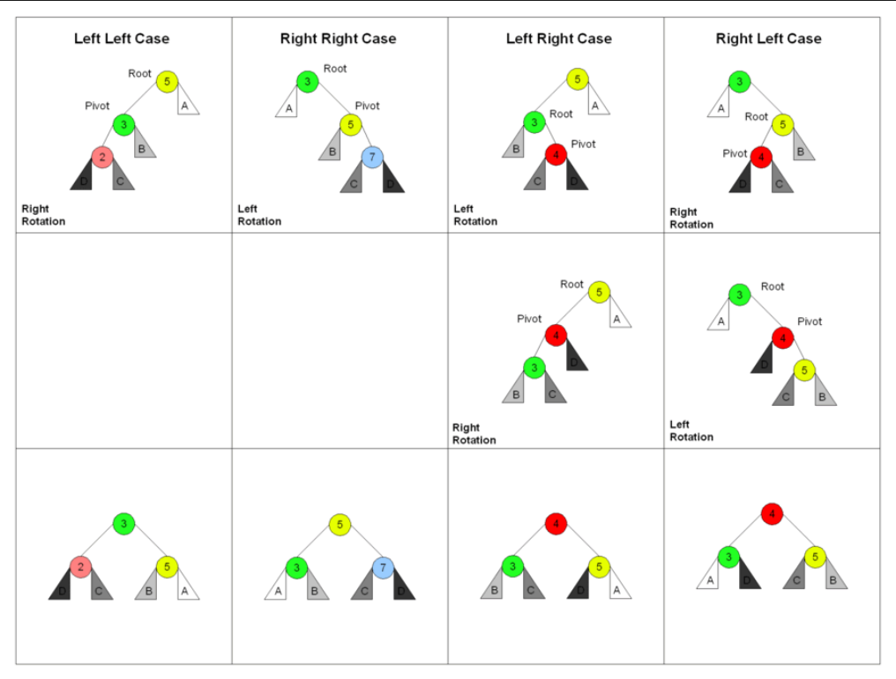
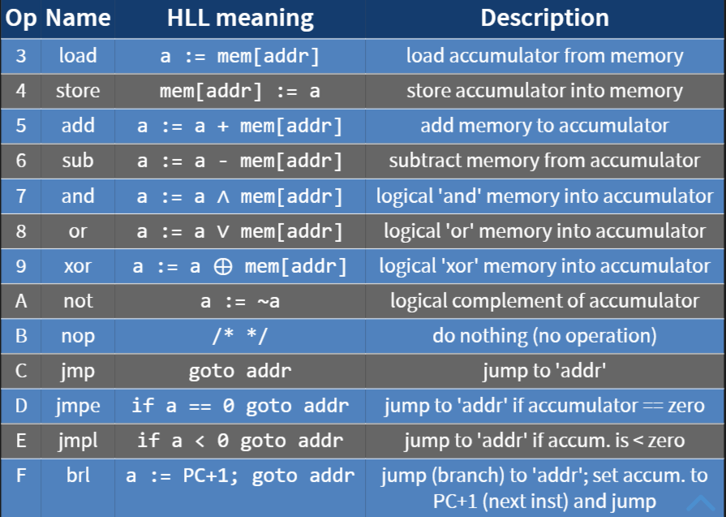

# ***Unit 2: Study Guide***

## **Trees**

### **Binary Search Trees**
- What are Binary Search Trees?
- Worst case time complexity
- Operations
  - find
  - insert
  - findMax(), findMin()
  - remove
- terms
  - height (and relationship with n)

### **Expression Trees**
- What are Expression Trees?
- infix, prefix, and postfix notation
- How does an expression tree?
  - i.e if you are given an expression tree, could you traverse it

### **AVL Trees**
- What are AVL Trees?
  - property
- Why AVL Trees?
- How does it balance itself?
  - balance factor
- operations
  - find
  - insert
    - four cases
      - LL
      - RL
      - LR
      - RR
    - left/right rotations

- time complexity for find, insert, remove, and print

### **Recursion**
- 3 things recursion needs
- pros/cons
- tail recursion

### **Red-Black Trees**
- What are Red-Black Trees?

- properties
- insert
  - 5 cases
- remove
  - 6 cases
- red-black trees vs AVL

### **Splay Trees**
- What are splay trees?
- Time Complexity
- Amortized Analysis
- Applications

## **Hashes**
- stacks and queues
- What are hashtables?
- Why use them?
- hashfunction
  - properties
- collisions
  - resolving collision techniques
    - separate chaining
      - load factor
      - time complexity for find()
      - time complexity for insert()
    - open addressing
      - linear probing
        - how it works
        - problems
      - quadratic probing
        - how it works
      - double hashing
        - how it works
        - thrashing issue
    - table size must be prime
  - Rehashing
  - removing an element
    - placeholder 
    - sentinel value
  - MD<sub>5</sub> and SHA
    - applications

## **Machine Language**

- memory hierarchy
- PC and IR

### **Memory Format**
- instruction format
- instructions
  - halt
  - i/o
  - shift
  - others

- labels
- declaring variables
- how to write IBCM
  - what steps do the professors suggest?
  - conditionals, loops, and arrays
- encoding and decoding

## **Assembly Language**

- declaring variables
- ```move <dest>, <src>```
  - square brackets
  - adding memory addresses
  - restrictions

### **Data Movement**

- pop
- lea
- add
- sub
- inc
- dec
- imul
- idiv
- logical instructions
- control instructions

### **Calling Conventions**

- what are calling conventions
- stack and heap
- Rules
  - caller
  - callee
- register usage
- Caller Rules
  - prologue
  - subroutine
  - epilogue
- Callee Rules
  - prologue
  - function
  - epilogue

### **Activation Records**
- What are activation records?
- how is memory managed?
- buffer overflow attack

RISC vs CISC


## **Miscellaneous**

### **Makefile**
  - how clang++ works
  - ```make``` command
  - variables
  - rules
  - targets
  - prerequisites
  - how to create a Makefile

### **Bash Scripting**
- bash scripting commands
- important commands (not exhaustive): 
```bash
echo
cat
mkdir
rmdir
rm
# many more
```
- conditionals and loops
- pipes


## **Unit 1 Materials**
- floating point conversion
- time complexity for algorithms
- algorithms
- two's-complement
- array addressing
- debugging
