# ***Module 1 Study***

### **Vocabulary**

- **directed**: one node points to another; ordered
- **undirected**: edges do not have direction; unordered
- **vertices**: nodes
    - degrees: in-degree vs out-degree
- **edges**: connection between nodes
- size of graph measured by V (nodes/vertices) and E (edges)
- **connected graph**: undirected graph where each vertex can be reached from other vertices
- **strongly connected digraph**: directed graph where each vertex can be reach by other vertices
- dense graph => many edges; sparse graph => fewer edges
- path => sequence of vertices that connect to each other
    - simple path => no repeating vertices
- **cycle**: non-empty path with same starting and ending path
    - no node repeated except start and end node
- **acyclic**: no cycle
- unweighted graph is a graph where edges are the same value
- weighted graph is a graph where edges have different value

## **Facts**
- All trees are graphs (True)
- All linked-lists are graphs (True)
- All graphs are trees (False)
- A directed graph (without loops) always satisfies $|E| \leq \frac{|V|^2}{2}$ (False) because the most number of edges you can have is $V^2 - V$ which is larger than $\frac{|V|^2}{2}$
- For any graph, it is always the case that $|E| \in O(|V|^2)$ (True)
- A *directed graph* cannot have cycles, which makes them convenient to use (False) because directed graphs can have cycles
- When BFS exeuctes, it is possible that a node is put on the queue a second time, but it can never happen a third time (False) because the color will change automatically 
- For BFS, the queue can contain nodes with two unique distances but NOT three unique distances (True)

### **Graph Representation**
- adjacency matrix
    - better for dense graphs
    - lots of zeros so space is an issue

- adjacency list
    - better for more sparse graphs => space efficient
    - hard to find original nodes and in-degrees

### *Breadth-First Search (BFS)*

- traverse the graph
- output the shortest distance from starting node to each node in the graph

```python
BFS(G, s) # G is the graph of (V, E) and s is the source node
    for each vertex u in G.v # sets all the nodes to the color white, with no predecessor, and infinite distance
        u.color = "WHITE"
        u.pi = NULL
        u.d = infinity
    
    s.color = "GRAY" # sets up the source node 
    s.pi = NULL
    s.d = 0

    Q = 0
    Enqueue(Q, s)
    while Q != 0 # keeps iterating until the gray vertices don't exist
        u = Dequeue(Q)
        for each v in G.adj[u]
            if v.color == "WHITE"
                v.color = "GRAY"
                v.d = u.d + 1
                v.pi = u
                Enqueue(Q, v)
        u.color = "BLACK"
```

- Running Time = O(V + E)

### *Depth-First Search (DFS)*

```python
DFS-SWEEP(G) # G is the graph of (V, E)
    for each vertex in G.V # initialize the nodes
        u.color = "WHITE"
        u.pi = NULL
    time = 0
    for each vertex u in G.V
        if u.color == "WHITE"
        DFS-VISIT(G, u)

DFS-VISIT(G, u) # G is the graph of (V, E) and u is a node of interest
    time = time + 1
    u.d = time
    u.color = "GRAY"
    for each v in G.Adj[u] # visits adjacent nodes and updates
        if v.color == "WHITE"
            v.pi = u
            DFS-VISIT(G, v)
    u.color = "BLACK"
    time = time + 1
    u.f = time

```

- traverse through a tree
- find if a graph is acyclic
- $\Theta(V + E)$

Types of Edges: Let $E = (u, v)$
- **tree edge**: edge used to first discover a node
- **back edge**: child connects directly to parent
  - discover a gray node
- **forward edge**: nontree edges that connect u to a descendent v
  - check if $v$ is black
  - $u.s < v.s$ AND $u.f > v.f$
- **cross edges**: all other edges
    - $u.s > v.s$ AND $u.s > v.f$
    - $u.s > v.s$ AND $u.f > v.f$
    - $v == BLACK$ AND $u.s > v.s$

- Running Time = O(V + E)

### *Topological Sort and Strongly Connected Components*

**Topological Sort**

```python
DFS(G)
    toposort-list = []
    for each vertex u in G.V
        u.color = WHITE
        u.pi = NULL
    time = 0
    for each vertex u in G.V
        if u.color == WHITE
    DFS-VISIT(G, u)

DFS-VISIT(G, u)
    time = time + 1
    u.d = time
    u.color = GRAY
    for each v in G.Adj[u]
        if v.color == WHITE
            v.pi = u
            DFS-VISIT(G, v)
    u.color = BLACK
    time = time + 1
    u.f = time
    toposort-list.prepend(u)
```

- find an order of nodes of a DAG such that all dependencies are satisfied

**Strongly Connected Components**
- run DFS on graph G
- find G<sup>T</sup>
- run DFS on largest finish time

### **Study Questions**

**Graph Theory Representation Questions (from book)**

22.1-1

Out-Degree: E; for loop to go through all the vertices and another for loop to look count connecting nodes
In-Degree: E; loop through main vertices and another loop to count connecting vertices

22.1-2

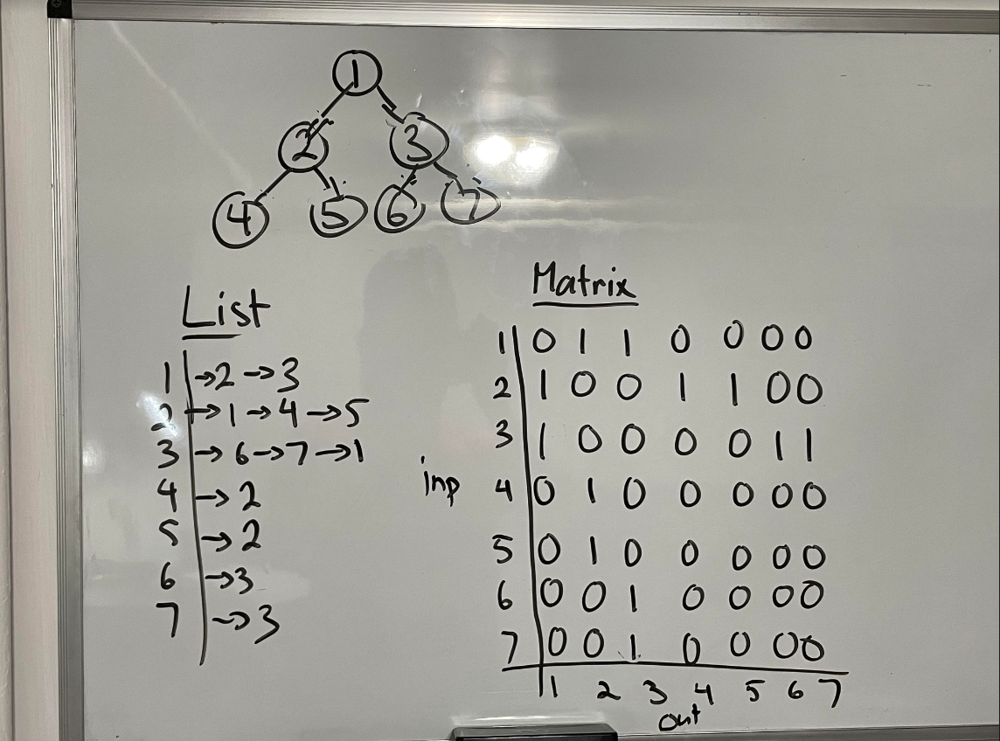

22.1-3

Adjacency-List
1. Make an empty adjacency list for G<sup>T</sup> with all the nodes (V)
2. loop through all nodes u in G list (V)
    - loop through linked-list of each node v (V)
        - insert u as value for key v in G<sup>T</sup>
3. return G<sup>T</sup>-list (1)

Running Time:

V + V * V + 1 = V + V<sup>2</sup> + 1 = V<sup>2</sup> = O(E)

Adjacency-Matrix
1. Make an empty G<sup>T</sup>-matrix initialized with all zeros (V<sup>2</sup>)
2. loop through all nodes u in G-matrix (V)
    1. loop through G-matrix nodes v (V)
        1. if 1 is found at [u][v] in G-matrix => insert 1 at G<sup>T</sup>-matrix in index [v][u] (1)
3. return G<sup>T</sup>-matrix (1)

Running Time: 

V<sup>2</sup> + V<sup>2</sup> = 2V<sup>2</sup> = V<sup>2</sup> = E

**Breadth First Search and Corrections Questions**

1. List two purposes of BFS.
    - traverse the tree
    - shortest path of each vertex from the source node

2. Run a BFS algorithm on the following graph:
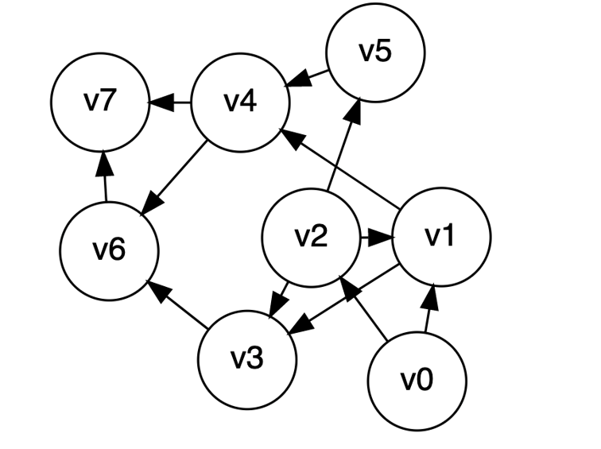
    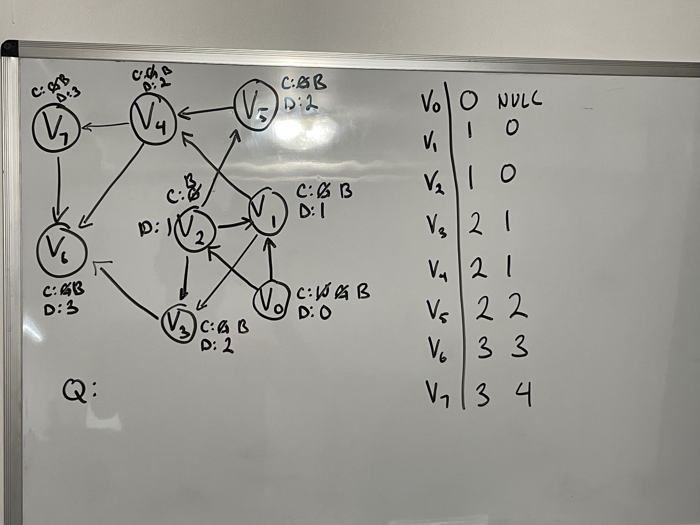

3. What is the runtime of BFS?

    V + 1 + 1 + V * V + 1 = V + V<sup>2</sup> = V + E = $\Theta(V + E)$

4. Prove the correctness of BFS and its Lemmas.

    **Lemma 1:**

    Given G = {V, E} where s is an arbritrary node and $(u, v) \in E$ and BFS ran; then,

    $\delta(s,v) \le \delta(s, u) + 1$

    Proof

    - Cases:
        1) If $(s, u) \in E$, then $\delta(s, v)$ cannot be longer than $\delta(s, u) + 1$; therefore, the inequality holds

        2) If $(s, u) \notin E$, then  $(s, u) = \infty$; therefore, $\delta(s, v) \le \infty + 1$ and the inequality holds
    
    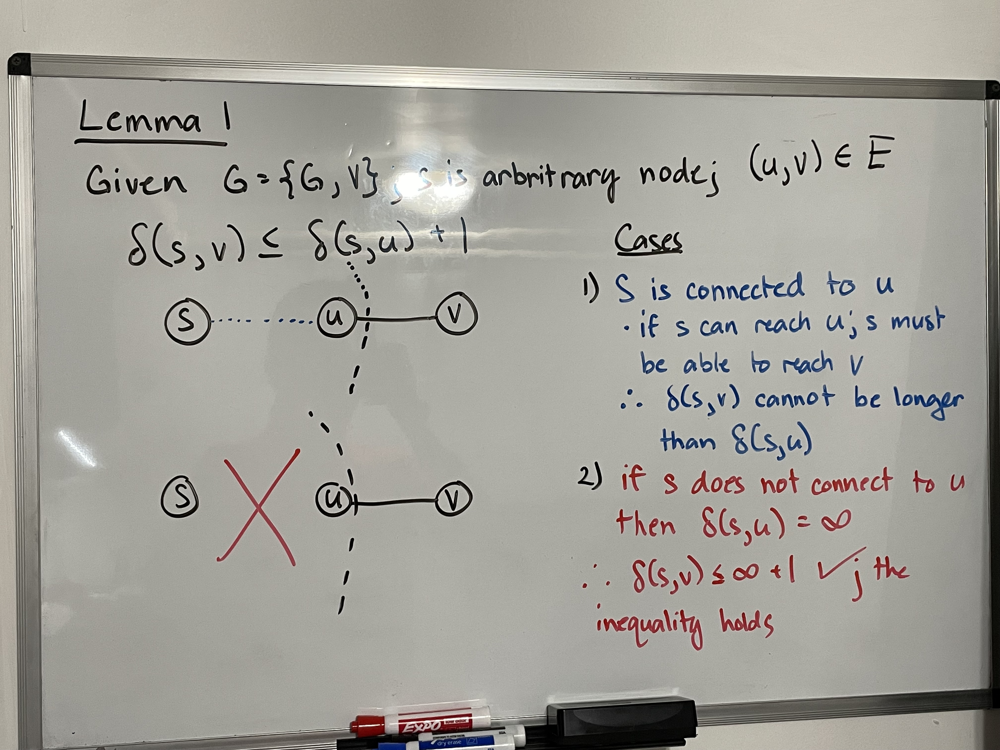


    **Lemma 2:** 
    
    Given G = {V, E} and BFS was run from node $s \in V$; 

    $v.d \ge \delta(s, v)$

    Proof

    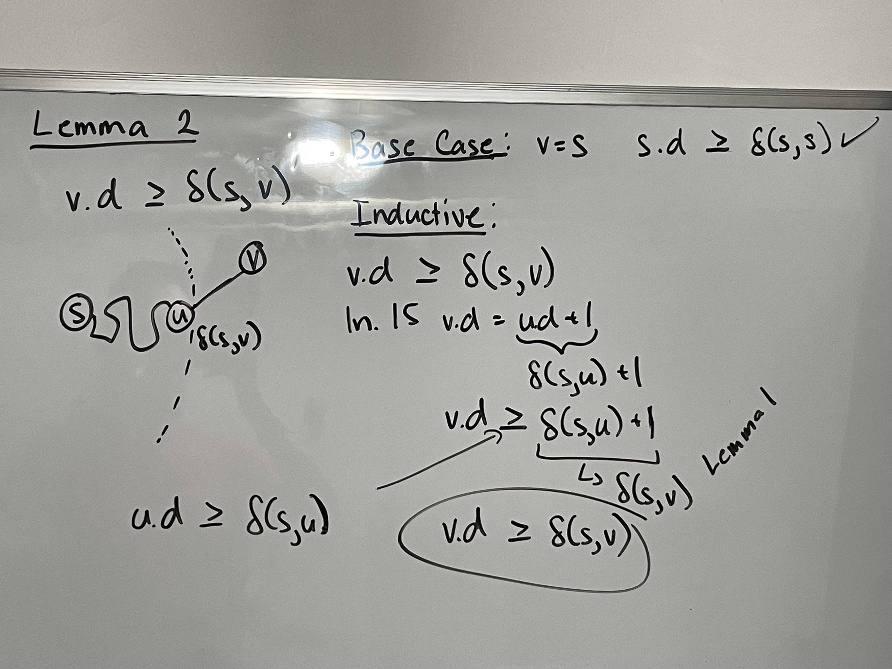


    **Lemma 3:**

    Given G = {V, E}, Q = {V<sub>1</sub> V<sub>2</sub> ... V<sub>r</sub>} and BFS is run;

    $V_{r}.d \le V_{1}.d + 1$ and $V_{i} \le V_{i+1}.d$ 

    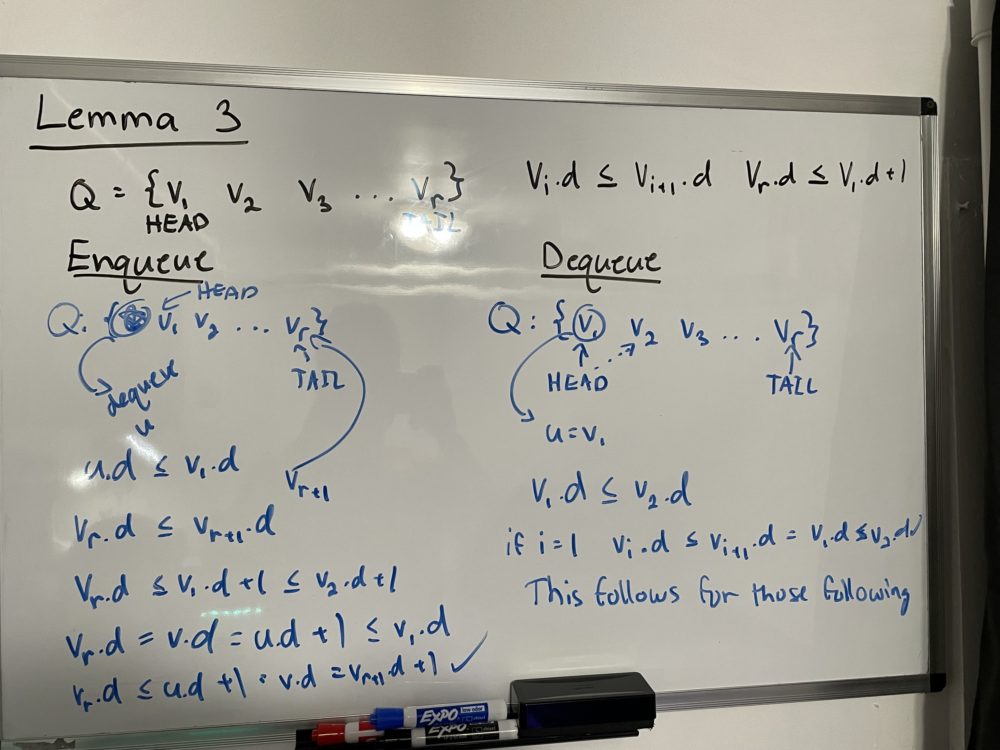

    **Correctness of BFS**

    Prove by contradiction.

    If BFS does not work, then there must exist at least one node v such that $v.d > \delta(s, v)$

    We can transform the expression to $v.d > \delta(s, v) = \delta(s, u) + 1$ by the definition of optimal solution. Through how we choose v, the transformations then becomes $v.d > \delta(s, v) = \delta(s, u) + 1 = u.d + 1$

    $v.d > \delta(s, v) = \delta(s, u) + 1 = u.d + 1$

    Cases:
    1) v is white
        - by ln. 15, v.d = u.d + 1 (CONTRADICTION)
    2) v is gray
        - V is enqueued into Q and let W be the node that was dequeued
        - ln. 15, v.d = w.d + 1
        - Order of Q would be w, u, v => $w.d \le u.d + 1 \le v.d + 1$ by Lemma 3
        - Then $v.d = w.d + 1 \le u.d + 1$ (Contradicts)
    3) v is black
        - v was dequeued before u implies that $v.d \le u.d$
        - $v.d \le u.d \le u.d + 1$ (Contradicts)

    Final...
    - $v.d \not> \delta(s, v)$ because of 3 cases
    - $v.d \not< \delta(s, v)$ because of lemma 2
    - $\therefore v.d = \delta(s, v)$
    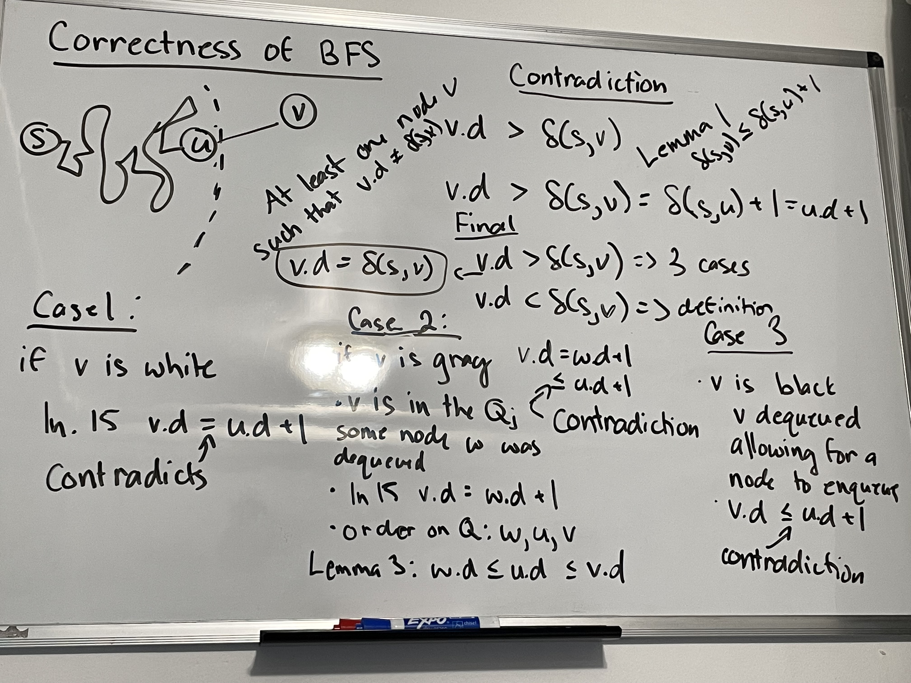

**Depth First Search Questions**

1. What is the main purpose of DFS?
    - traverse the graph

2. Compare DFS and BFS?
    - BFS finds shortest distance while DFS does not
    - BFS finds all adjacent nodes before traversing to next level
    - both DFS and BFS traverse the graph
    - DFS goes through all the levels first of a node first

3. Run DFS on this graph.

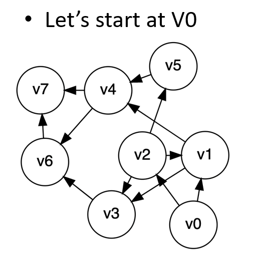

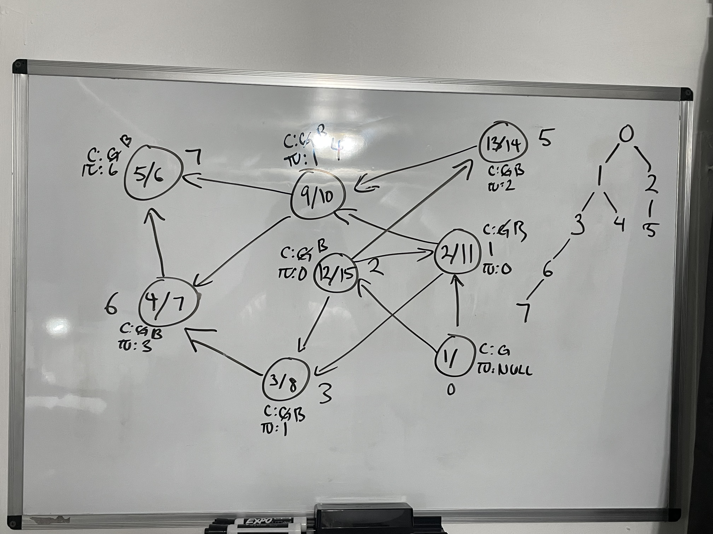

4. DFS Runtime.

    V + V * V = V + V<sup>2</sup> = $\Theta(V + E)$

5. Explain one property of DFS.

    - **parenthesis theorem**: 
    
        - if [v.d, v.f] is in [u.d, u.f], then u is a parent of v
        - if [v.d, v.f] and [u.d, u.f] are disjoint, then not descendents of each other
    

6. Explain the various types of edges.
    - tree edges: edge traversed to find a white node
    - back edge: edge that points back to parent
      - if pointing to gray node
    - forward/descendent edge: edge that points directly to descendent node
    - cross edge: edge that connects two nodes with no relationship say $E = (u, v)$
      - 

    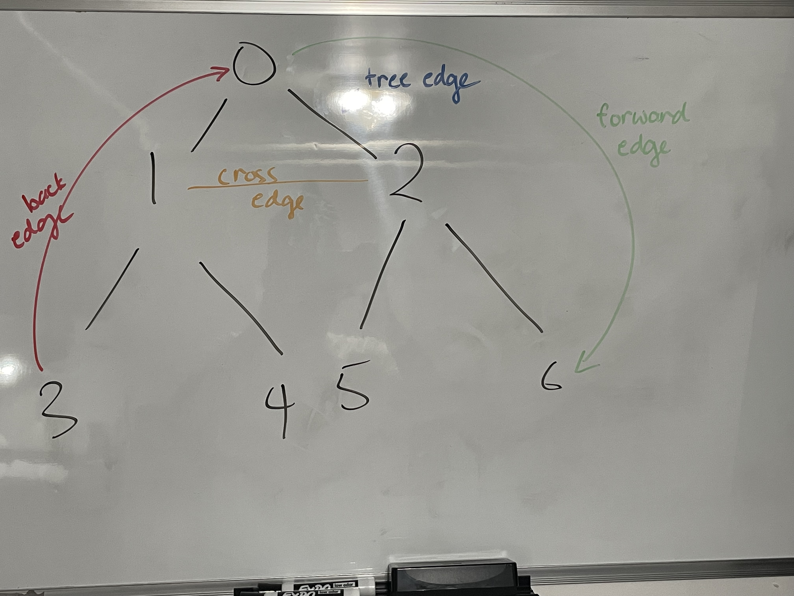

7. How might you use DFS to find tree edges, back edges, descendent edges, and cross edges?
    - tree edges => when the edge traversed leads to a white node
    - back edges => when next node points to a gray node
    - descendent edges => find a black node and interval is within parent edge
    - cross edges => interval is not within parent node

8. How might you use DFS to find if a graph is acyclic?
    - if back edge is found => graph is cyclic

22.3-7
 ```python
DFS(G, s)
    Stack s;
    for v in G.V
        v.color = WHITE
        v.pi = null
    time = 0

    s.insert(s)

    while s != 0
        u = s.pop()
        for v in Adj[u]
            if v.color == WHITE
                v.color = GRAY
                s.insert(v)
        u.color = BLACK
 ```

 **Topological Sort and SCC Questions**

 1. Run Topological Sort on the following graph.

 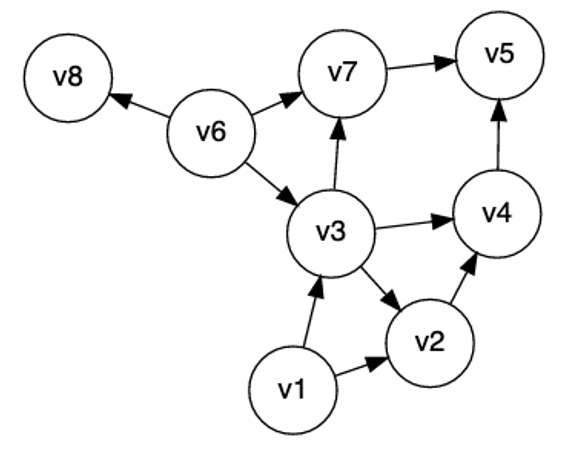

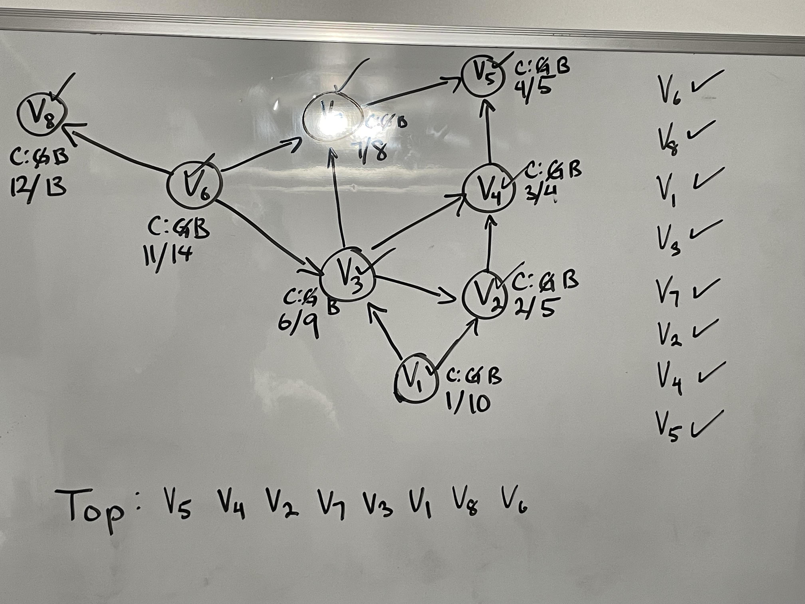

 2. Applications of Topological Sort.

    - how to plan what an order to wear clothes
    - task management
    - dependencies of a library (order of downloading them)

 3. Purpose of TPS.
    
    - sort the nodes of a DAG in an order such that all the dependencies are satisfied
    - multiple possible ways

 4. What does SCC find?
    - finds strongly connected components => finds groups of nodes that connect to each other but cannot connect to other nodes

 5. Briefly explain how to use SCC.
    - run DFS on G
    - find G<sup>T</sup>
    - run DFS on G<sup>T</sup> starting with node with largest finish time

 6. Run SCC on this graph.

 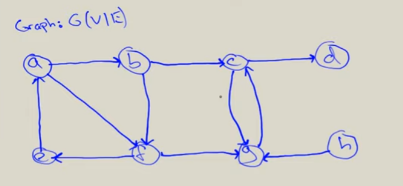

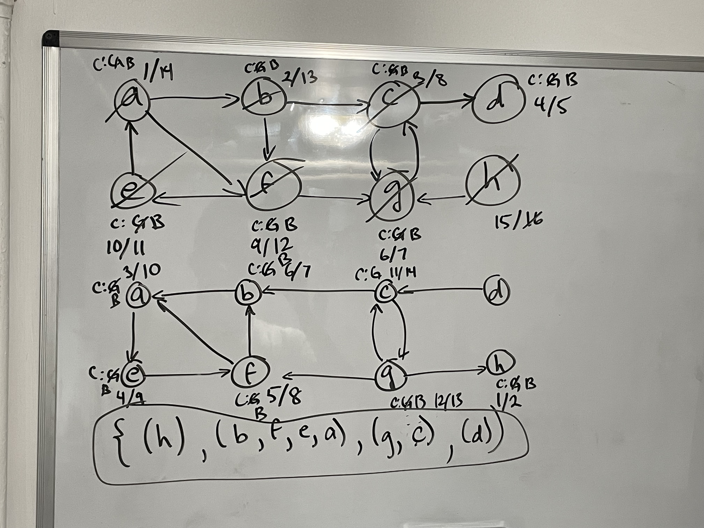

---

## ***Resources***

Introduction to Algorithms, 3rd Edition by Thomas H. Cormen, Charles E. Leiserson, Ronald L. Rivest, and Clifford Stein


