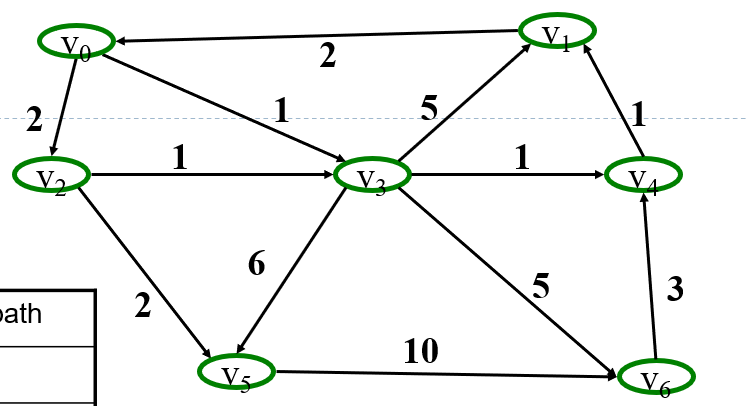
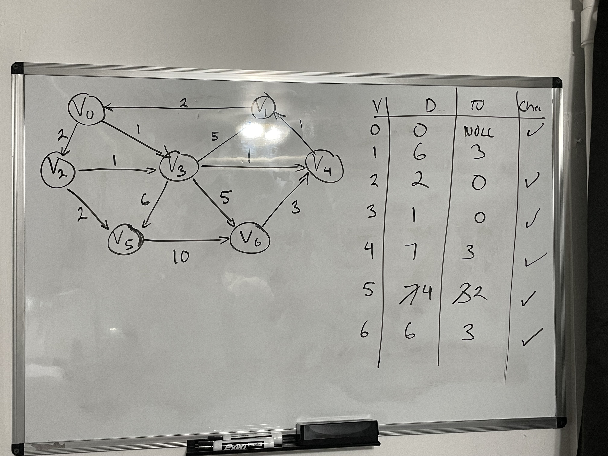
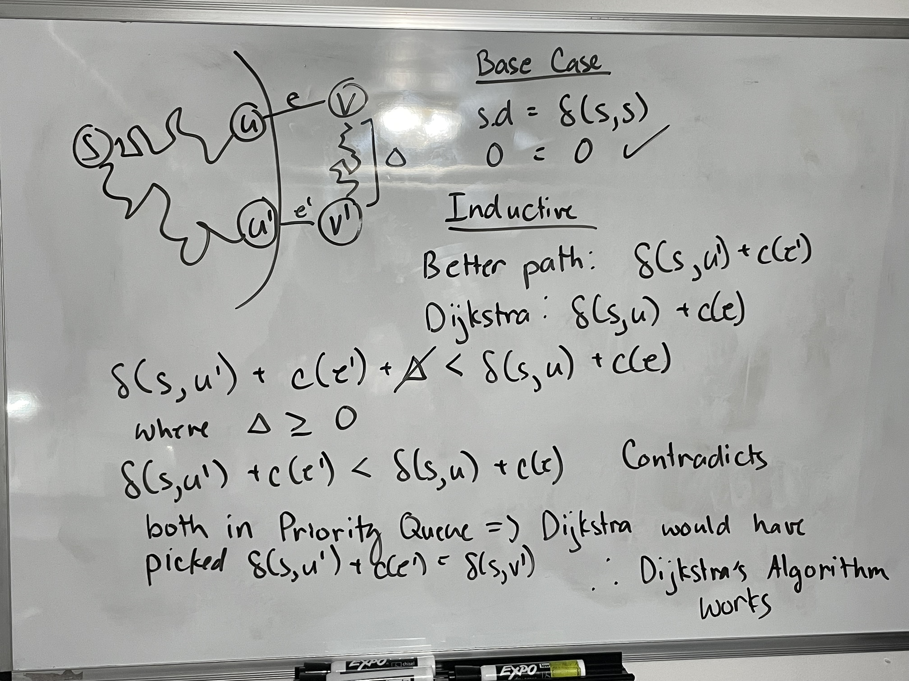
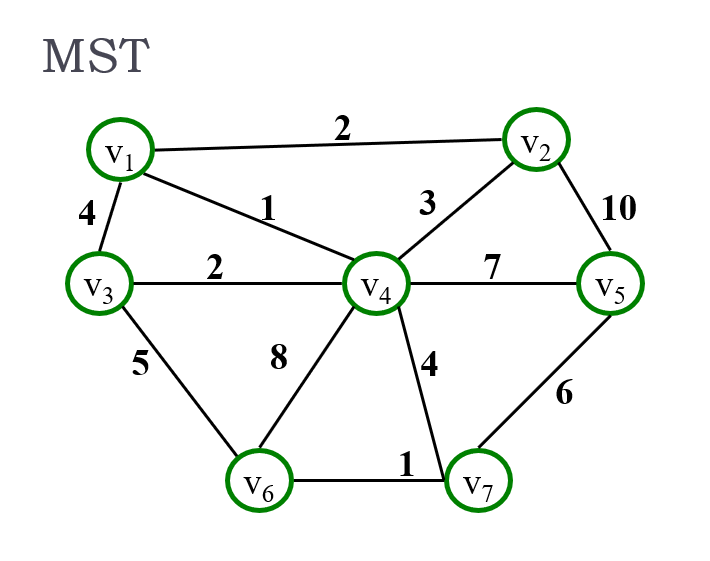
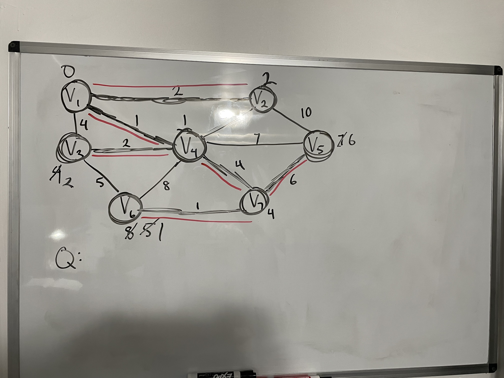
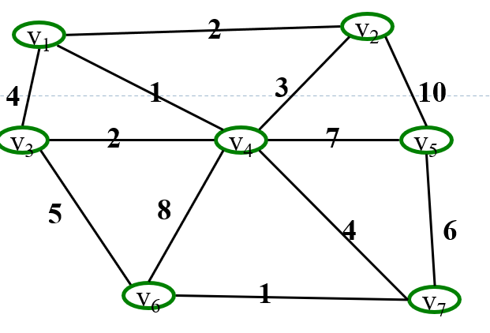

# ***Module 2 Study***

## **Facts**

- *Dijkstra's* might still work with negative cost edges (but not guaranteed). (True)
- In *Dijkstra's Algorithm*, a node that is not reachable from the start node will still eventually become *known* (False) because  

### **Dijkstra's Algorithm**

**greedy algorithm**: best decision at every decision point

Assumptions:
- no negative weights

```python
DIJKSTRA(G, w, s):
    INITIALIZE-SINGLE-SOURCE(G, s)
    S = 0
    Q = G.V # priority queue
    while Q != 0
        u = EXTRACT_MIN(Q)
        S = S + u
        for each vertex v in G.Adj[u]
            RELAX(u, v, w)
```

- Implementation:
    - indirect heap: use an additional array that stores the location of the value
    - hashmap: to find the node number
- Naive Runtime: $O(|V|^2)$


### **Prim's Algorithm**

**Minimum Spanning Tree**: a tree where the sum of the edges is at the minimum

```python
MST-PRIM(G, w, r)
    for each u in G.V
        u.key = inf
        u.pi = NIL
    r.key = 0
    Q = G.V
    while Q != 0
        u = EXTRACT-MIN(Q)
        for each v in G.Adj[u]
            if v in Q and w(u, v) < v.key
                v.pi = u
                v.key = w(u, v)
```

### **Kruskal's Algorithm**

```python
MST-Kruskal(G, w)
    for each vertex v in G.V
        MAKE-SET(v)
    sort the edges of G.E into nondecreasing order by weight w
    for each edges (u, v) in G.E, taken in nondecreasing order by weight
        if FIND-SET(u) != FIND-SET(v)
            A = A + {(u, v)}
            UNION(u, v)
    return A
```


## **Study Questions**

**Dijkstra's Algorithm**

1. What is the purpose of Dijkstra's Algorithm?
    - traverse the graph
    - find shortest distance to each node from start node

2. What is a greedy algorithm?
    - algorithm that chooses the best decision at each decision point

3. How does Dijkstra's Algorithm work?
    - run BFS and update the graphs depending on whether the distance from that node to the source node is shorter

4. What is Dijkstra's Algorithm Runtime Complexity without indirect heap?

    V + V * (logV + V * (V<sup>2</sup>)) = Vlog(V) + EV = O(Vlog(V) + EV)

5. What is Dijkstra's Algorithm Runtime Complexity with indirect heap?

    V + V * (logV + V * (V<sup>2</sup>)) = Vlog(V) + Elog(V) = O((V + E)logV)

6. Run Dijkstra's Algorithm on this graph.





7. Proof Dijkstra's Algorithm.



**Prim's Algorithm**

1. Describe what a Minimum Spanning Tree is?

    - a graph where there are no cycles and the sum of the edges of the weight are at the minimum

2. What is the purpose of a Minimum Spanning Tree?

    - lowest cost of the sum of weights

3. How does Prim's algorithm differ from Dijkstra's Algorithm?

    - Prim's only cares about the weights of the edges
    - Dijkstra's cares about the shortest path

4. Prim's Runtime with Indirect Heap.
    V + V + V * (log(V) + Vlog(V)) = Vlog(V) + Elog(V) = O((V + E)log(V))

5. Run Prim's Algorithm on this graph.






**Kruskal's Algorithm and Find-Union**

1. How does Kruskal's Algorithm differ from Prim's Algorithm?

    - Prim grows one tree as Krukal's combines trees in a forest

2. Run Kruskal's Algorithm on this Graph with optimal disjoint set.




3. What is Kruskal's Runtime.

    V + V * (Vlog(V)) + E = V + V<sup>2</sup>log(V) + E = $\Theta(Elog(V))$

4. What are the three operations for disjoint sets?
    - MAKE-SET: makes a new set with a representative
    - UNION: links two sets together
    - FIND-SET: finds the representative of a given set

5. What are two optimizations for disjoint sets.
    - path compression: all descendents point to parent
    - union by rank
